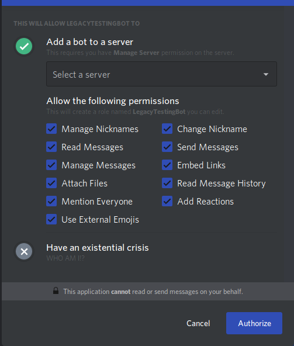

# Legacybot
This is a Discordbot for helping out with "play by post" games of [Legacy: Life Among the Ruins](https://ufopress.co.uk/our-games/legacy-life-among-ruins/). If you want to jump right in, the commands used by the bot are listed below, and the [TUTORIAL.md](TUTORIAL.md) has a bunch of examples. 

Legacy Bot is currently in ALPHA TESTING and as such any data written to it can be blown away at any moment! Once it proceeds to BETA it will have permanent storage.

## Installation
Paste https://discordapp.com/api/oauth2/authorize?client_id=619678791626915850&permissions=201837632&scope=bot into your browser and select the server you'd like the bot to join.

If you'd like to run the test bot, paste https://discordapp.com/api/oauth2/authorize?client_id=621907047587512330&permissions=201837632&scope=bot 

Legacybot has very limited permissions:

## Commands
All commands to Legacybot begin with a dot "."  Legacybot's command help is built in to the bot; to get started, typing in `help -c`

## Development
First clone this Github repo locally.

### Configuration
Second, create your bot on the [Discord Developer Portal](https://discordapp.com/developers/applications/). 

Third, make a note of the your `token` and `owner id`. These can be configured into the app in two ways:

1) Via `config/default.json`. Put the token and owner_id into these fields. Note, this is not secure, so please be careful!
2) By setting the environment variables `LEGACY_BOT_TOKEN` and `LEGACY_BOT_OWNER_ID`. These will override the config/default.json file keys. 

### Installing Locally
Run `make install`

### Testing
Run a `make test` to run the unit tests. Tests can be found in the `test` folder. Note, the db tests assume you have a locally running instance of Mongodb. 

### Running
Run `make run`

## Supported Family Playbooks

## Supported Classes 

