# LegacyBot Tutorial 

This document teaches you how to use Legacybot! This is a bot that will help you play the Legacy Game from UFO Press. 

NEW USER NOTE! Legacybot currently doesn't support running commands through anything but the web interface due to lack of support for Apple's UNICODE versions of the quote character `"` and the `-` character. Legacy bot, as a flavor of [UNIX command line](https://en.wikipedia.org/wiki/In_the_Beginning..._Was_the_Command_Line)  makes extensive use of both characters. 

## Getting Started 

LegacyBot's help system is built into the tool. All LegacyBot commands start with a `.` (period). The first command to remember is the help command. Run it by typing in `.help` or `.h` (all LegacyBots come with a shorthand "alias" or faster typing).

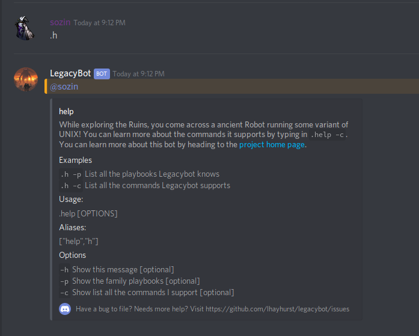

You can learn about what commands are available by typing in `.help -c`, or `.h -c`. 

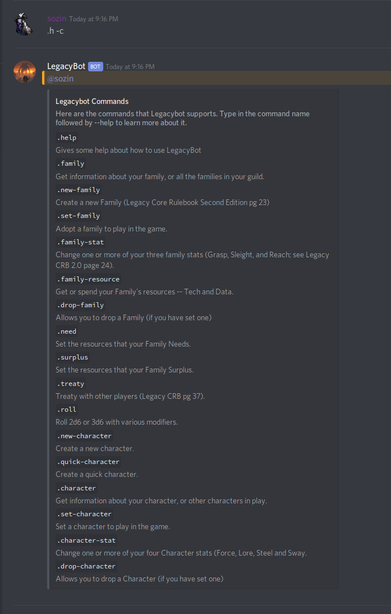

That's a lot of commands! Fortunately, each command comes with its own built-in help with examples. 

## Starting a Family 

The `.family` is how you check your and other player's families, but before you do that you have to create a family first. Run the `.new-family --help` command first.

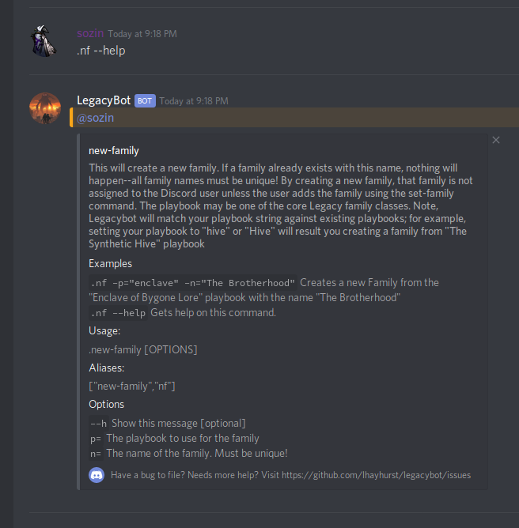

Let's  create a family using the suggested example by running the command `.nf p=tyrant n="The Citadel"`

And you should see something like this -- ah, LegacyBot, babbling in the native tongue of long-dead programmers!

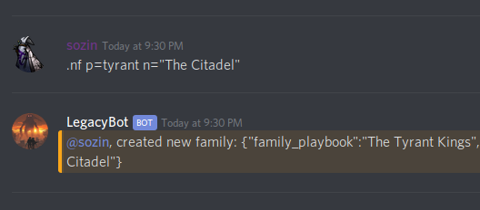

Note that, even though I typed in `p=tyrant`, it matched the playbook against `The Tyrant Kings`. Legacybot will do that for any playbooks you type in that match, as a subset, against the Legacy Family Playbooks.

Anyone can create a family, but it takes a reach warrior to take ownership of it! To do that you run the `.set-family`, or `.sf`, command. In this case, `.sf "The Citadel"`.

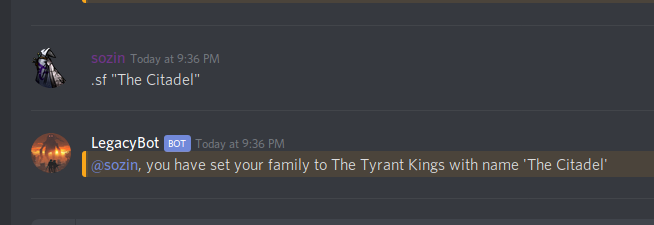

Now that you've set your family, you can use the `.family` command to have a look at it. Run the command `.f`:

## Being a Family

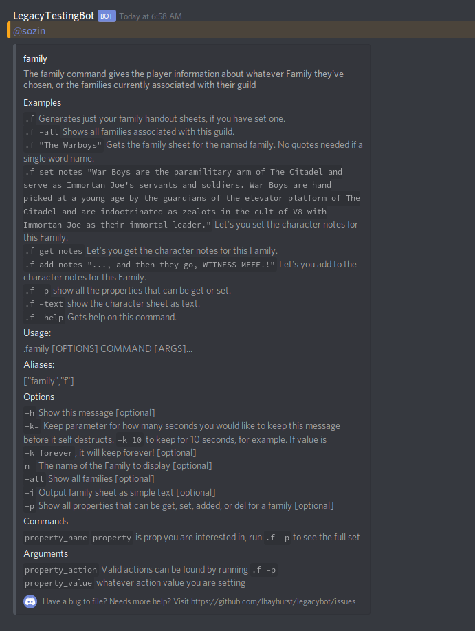

Note that both the family and character commands have a simple "text" mode output. Run `.f --text` to see it!

## Family Attributes and Stats

Families have a bunch of things you can set on them. Let's start by setting their notes using this command: `.f notes "The Citadel is the stronghold of Immortan Joe. Joe maintains his control through a loyal corps of War Boys, whom are picked from The Wretched as War Pups and indoctrinated from childhood to believe that Immortan Joe is a god and following his orders will grant them eternal afterlife. The War Boys defend the Citadel, escort trade caravans, and scavenge the countryside for useful scrap and slaves."` 

Note that you can manipulate all of your Family attributes using this style. Run the command `.f --p` and `.f --help` to learn more. For example, here's how you add a move: `.f add move "Lords of the Deep"`.

You can also set your `Reach`, `Grasp`, and `Sleight` stats using the `.family-stats` command. Here's an example, setting Reach to 1, Grasp to 0 and Sleight to -1. `.fs r=1 s=-1 g=0`

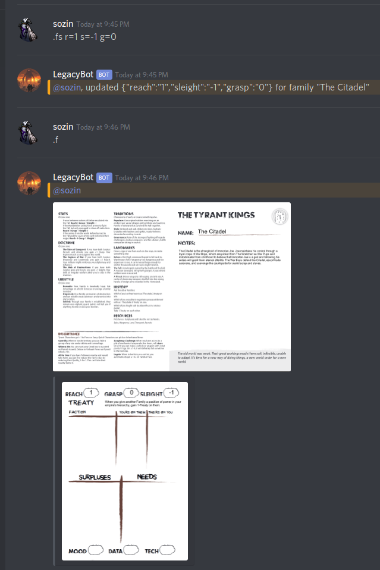

## Family Resource Tracks
Mood is automatically calculated from Surplus and Need, but Data and Tech are set using the `family-resouce` command. To get a resource, do something like this: `.fr get data`. To spend a resource, do `.fr spend data`. You can get or spend more than one by using a `+` modifier, for example `.fr get data +2`. 

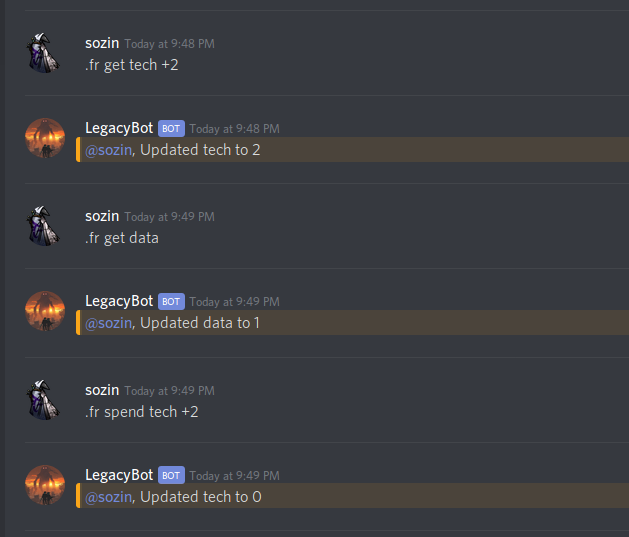

## Treaty

Treaty can be given or taken using the `.treaty` command. To give treaty to another Family, use the `.t give` command. For example:

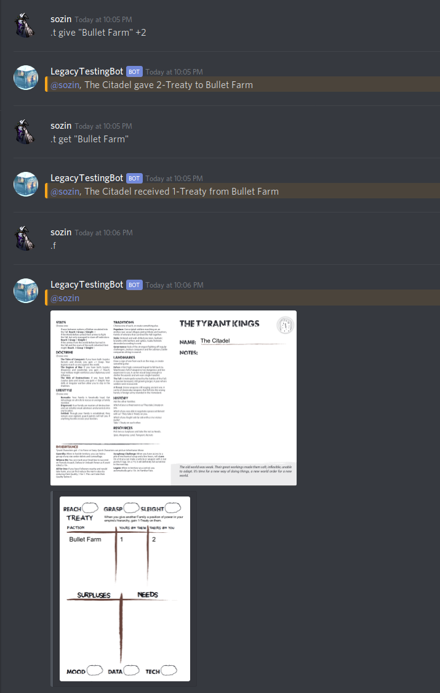

Treaty can be spent using `.treaty spend "Bullet Farm"`, for example. Remember you can always do a `--help` with any command, or example `.treaty --help`.

## Surplus and Need
Surplus and need can be managed using the `.surplus` and `.need` commands. They are easy to use. To create a surplus, do something like `.surplus add "Barter Goods"`. 

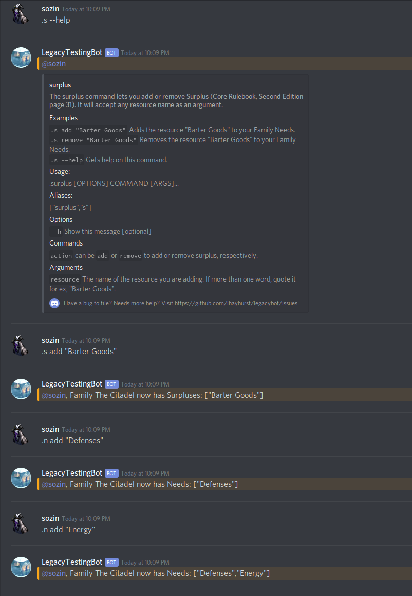

After you've added some needs and surpluses, they will show up on your Family sheet, along with Mood:

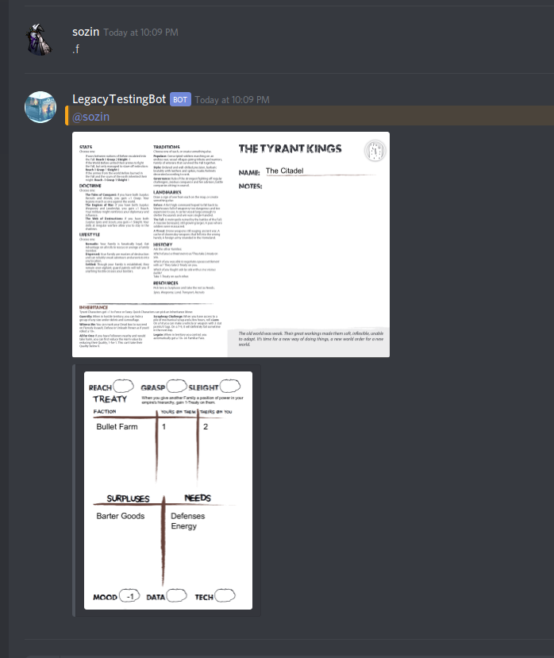

## Rolling Dice

Legacybot has a complete dice rolling solution. Run `.roll --help` to have a look:

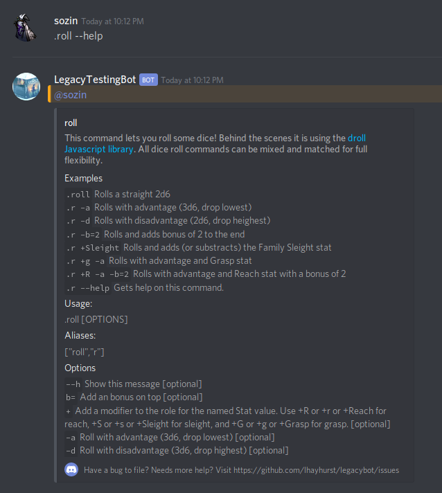

Let's roll some bones!

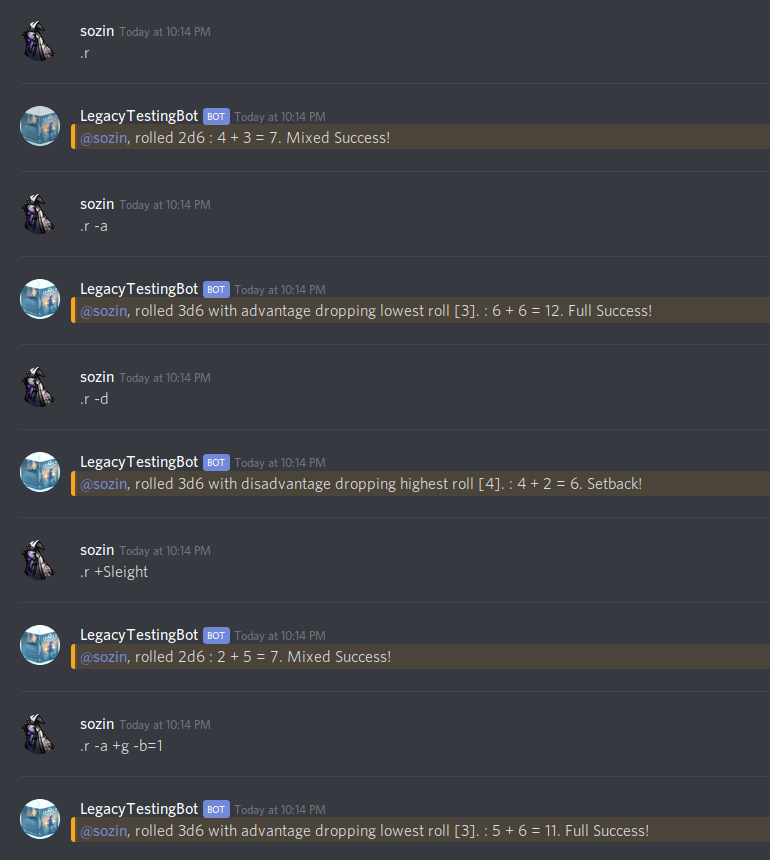

## Character Playbooks

Legacybot supports Characters too! To create a new charcter, run the `.character`. Note, you have to have an associated family before you can create a standard character. As with Families, Legacybot will auto-match against existing Character Playbooks if the playbook you type in contains their name.

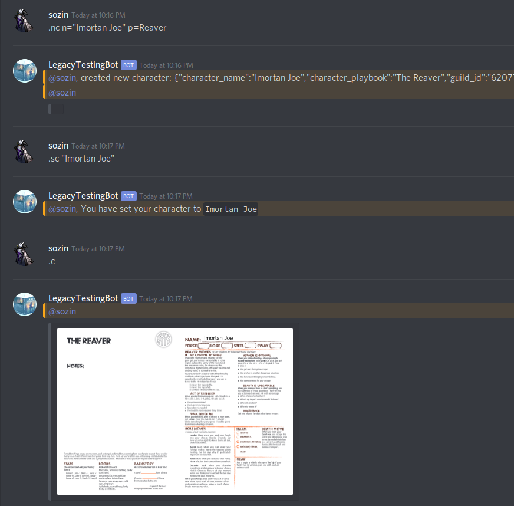

You can also create Quick Characters using the `.quick-character` command.

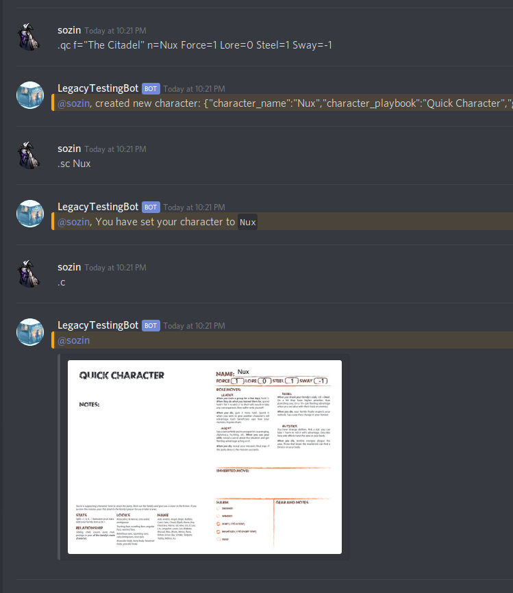

## Character Attributes

Character notes can be set the same way as family notes, using the `.c note` command. For example, if I type in `.c note "Nux was originally a follower of Immortan Joe and was willing to die for his cause, attempting to impress him on several occasions. ... Nux was found on the war-rig by one of Immortan Joe's wives and was taken in, eventually becoming a vital member of Furiosa's team."` and then run the `.c` command I get:

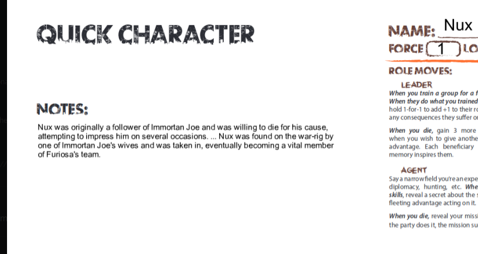

Finally, character stats can be set using the `cs` command. 

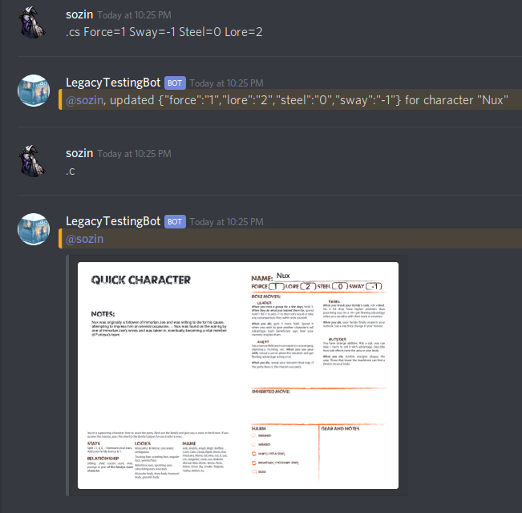

 

