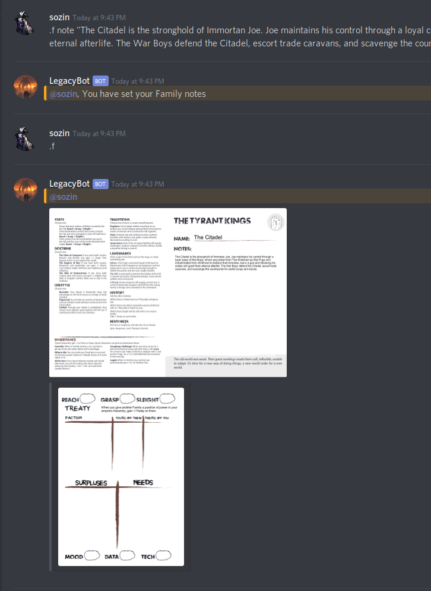

# LegacyBot Tutorial 

This document teaches you how to use Legacybot! 

## Getting Started 

LegacyBot's help system is built into the tool. All LegacyBot commands start with a `.` (period). The first command to remember is the help command. Run it by typing in `.help` or `.h` (all LegacyBots come with a shorthand "alias" or faster typing).

You can learn about what commands are available by typing in `.help -c`, or `.h -c`. 

That's a lot of commands! Fortunately, each command comes with its own built-in help with examples. 

## Starting a Family 

The `.family` is how you check your and other player's families, but before you do that you have to create a family first. Run the `.new-family --help` command first.

Let's  create a family using the suggested example by running the command `.nf p=tyrant n="The Citadel"`

And you should see something like this -- ah, LegacyBot, babbling in the native tongue of long-dead programmers!

Note that, even though I typed in `p=tyrant`, it matched the playbook against `The Tyrant Kings`. Legacybot will do that for any playbooks you type in that match, as a subset, against the Legacy Family Playbooks.

Anyone can create a family, but it takes a reach warrior to take ownership of it! To do that you run the `.set-family`, or `.sf`, command. In this case, `.sf "The Citadel"`.

Now that you've set your family, you can use the `.family` command to have a look at it. Run the command `.f`:

## Family Notes and Stats

Families have a bunch of things you can set on them. Let's start by setting their notes using this command: `.f note "The Citadel is the stronghold of Immortan Joe. Joe maintains his control through a loyal corps of War Boys, whom are picked from The Wretched as War Pups and indoctrinated from childhood to believe that Immortan Joe is a god and following his orders will grant them eternal afterlife. The War Boys defend the Citadel, escort trade caravans, and scavenge the countryside for useful scrap and slaves."` 

You can also set your `Reach`, `Grasp`, and `Sleight` statistics using the `.family-stats` command. Here's an example, setting Reach to 1, Grasp to 0 and Sleight to -1. `.fs r=1 s=-1 g=0`

## Family Resource Tracks
Mood is automatically calculated from Surplus and Need, but Data and Tech are set using the `family-resouce` command. To get a resource, do something like this: `.fr get data`. To spend a resource, do `.fr spend data`. You can get or spend more than one by using a `+` modifier, for example `.fr get data +2`. 

## Treaty

Treaty can be given or taken using the `.treaty` command. To give treaty to another Family, simply `.t give 

 

